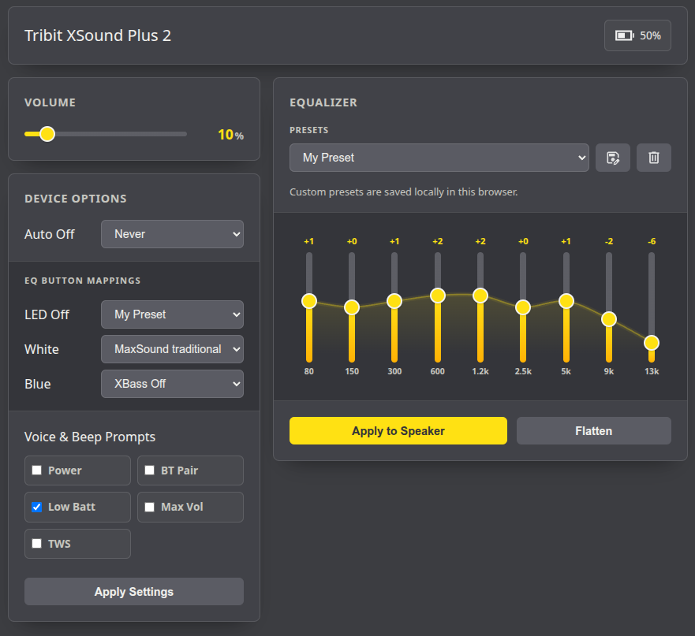

# Tribit Web Control

Tribit Web Control is a browser-based control app for supported Tribit speakers. It lets you connect over Web Bluetooth and adjust volume, EQ, auto-off settings, prompts, battery status, and EQ button mappings without relying on a native mobile app.

The project currently includes a speaker profile for the **Tribit XSound Plus 2**.

[Open the hosted app](https://dvdavd.github.io/tribitwebctl/)

Use the hosted version for the best experience. It runs over HTTPS, works well as an installable PWA, and is the recommended way to use the app.



Quick options:

- **Hosted app:** `https://dvdavd.github.io/tribitwebctl/`
- **Standalone file:** build or download `standalone.html` for a single-file local version

## Features

- Connect to a supported speaker with Web Bluetooth
- View battery percentage
- Adjust speaker volume
- Change the active EQ preset or edit a custom 9-band EQ curve
- Apply EQ changes live to the speaker
- Save custom EQ presets locally in the browser
- Configure auto-off timing
- Enable or disable voice and beep prompts
- Assign EQ presets to the hardware EQ button modes
- Install as a PWA for an app-like experience
- Build a single-file `standalone.html` version with inlined assets

## Project Structure

```text
.
├── index.html                 # Main app shell
├── styles/main.css            # App styling
├── js/main.js                 # App bootstrap and event wiring
├── js/bluetooth.js            # Web Bluetooth connection helpers
├── js/protocol.js             # Packet encoding/decoding
├── js/presets.js              # localStorage-backed custom presets
├── js/speakers/               # Speaker-specific profiles and capabilities
├── manifest.webmanifest       # PWA manifest
├── sw.js                      # Service worker for app shell caching
├── build.js                   # Standalone HTML build script
└── standalone.html            # Generated self-contained build output
```

## Requirements

- A browser with **Web Bluetooth** support
  - Chrome, Edge, or Opera work best
  - Chrome on Android works well
  - iOS typically requires a browser with Bluetooth support such as Bluefy
- Bluetooth enabled on the host device
- The app served from **`https://`** or **`http://localhost`**

Notes:

- On some Linux setups, Web Bluetooth may require enabling `chrome://flags/#enable-experimental-web-platform-features`.
- The speaker should not already be connected to the official app while this app is trying to connect.

## Distribution

This project is distributed in two forms:

- **GitHub Pages app (recommended):** `https://dvdavd.github.io/tribitwebctl/`
- **Single-file standalone build:** `standalone.html`

The GitHub Pages version is the primary distribution channel because it provides HTTPS, which is the most reliable way to use Web Bluetooth and the installable PWA features.

The standalone file is provided as a convenience option for people who want to keep a single local file and open it directly in a compatible browser.

## Running Locally

This project is a static web app. You can serve it with any simple local web server.

Example:

```bash
python3 -m http.server 8000
```

Then open:

```text
http://localhost:8000
```

Because `localhost` is treated as a secure context, Web Bluetooth can be used there without HTTPS certificates.

## Development

Install dependencies:

```bash
npm install
```

There is currently no dedicated dev server or test script in `package.json`; development is done by editing the static files and serving the project locally.

## Standalone Build

The build step creates a self-contained `standalone.html` file by:

- bundling JavaScript with `esbuild`
- inlining CSS
- embedding referenced assets as data URIs
- removing the CSP and manifest link for file-based usage

Build it with:

```bash
npm run build
```

The output is written to:

```text
standalone.html
```

Unlike the main app, the standalone build does not need a web server. You can open `standalone.html` directly from local disk in a compatible browser and use it as a single-file version of the app.

GitHub Actions also builds `standalone.html` automatically on pushes to `main` and on manual runs. The generated file is uploaded as a workflow artifact.

## Supported Speaker Profiles

Currently implemented:

- `LE_Tribit XSound Plus 2`

Speaker-specific behavior lives in `js/speakers/`. Adding support for more devices should mainly involve introducing another profile that defines:

- Bluetooth filters and GATT UUIDs
- supported EQ/settings capabilities
- command builders
- notification decoding
- friendly connection error handling

## Storage

Custom EQ presets are stored in the browser with `localStorage`. They are device-local and browser-local, so they will not automatically sync across browsers or machines.

## PWA Behavior

The app includes:

- a web app manifest
- a service worker that caches the app shell for offline reuse

Bluetooth control still depends on browser support and access to the local Bluetooth adapter. The hosted GitHub Pages version is the recommended way to use the PWA because it runs over HTTPS.

## Limitations

- Web Bluetooth support varies by platform and browser
- Only the currently implemented speaker profile is supported
- There is no automated test suite yet
- The standalone build is intended for convenience, but Bluetooth behavior can still differ by browser and platform
- Opening `standalone.html` from `file://` may behave differently from the hosted HTTPS version depending on browser security rules

## License

This project is licensed under the MIT License. See `LICENSE`.
